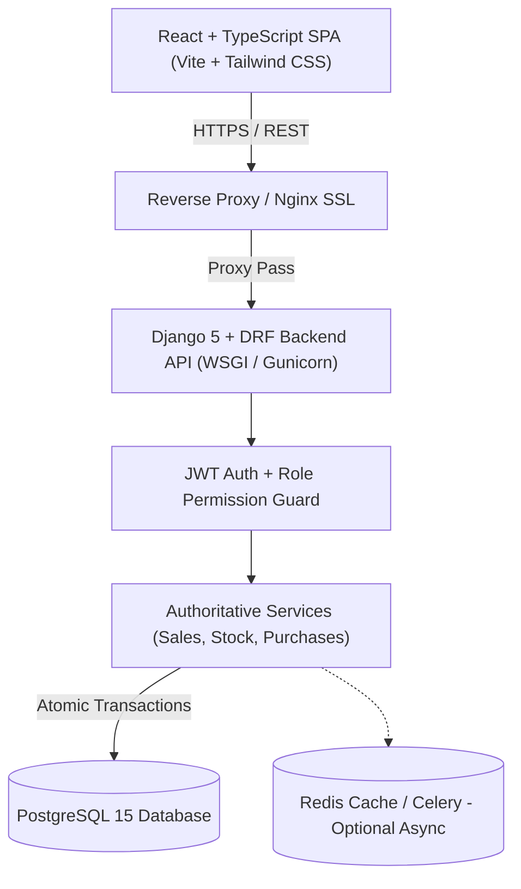
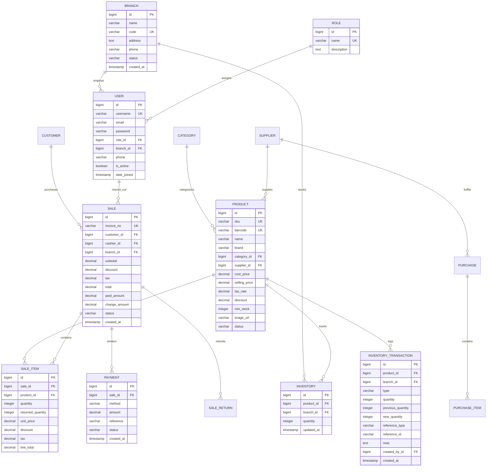

# Smart Retail POS — Master Architectural Blueprint & Specification (Phase 1)

---

## 1. System Architecture Overview

Smart Retail POS is designed as an enterprise-grade, cloud-ready retail point-of-sale and inventory platform built on a clean decoupled architecture:

---

## 2. Feature & Module Breakdown

| Module | Core Functionality | Primary Users |
|---|---|---|
| **Authentication & RBAC** | JWT login/refresh, strict role permissions, branch assignments, password resets | All staff |
| **POS Terminal** | Barcode scanner, keyboard shortcuts (`F1`-`ESC`), cart management, hold/resume, cash/card/UPI/mixed payments, receipt generation | Cashier, Manager |
| **Product Catalog** | SKU, Barcode, brand, category, cost/selling price, tax rates, discount limits, image uploads | Admin, Manager |
| **Inventory & Stock** | Branch stock levels, low-stock alerts, manual adjustments, audit-trailed `InventoryTransaction` | Inventory Officer, Manager |
| **Purchasing & Suppliers**| Supplier profiles, PO drafting, multi-item purchase orders, partial/full stock receiving | Manager, Admin |
| **Customer & Loyalty** | Profiles, purchase history, store credit limits, automated loyalty points earning | Cashier, Admin |
| **Returns & Refunds** | Itemized return flow, quantity validation, refund computation, stock replenishment | Cashier (Request), Manager (Approval) |
| **Reports & Analytics** | Daily/weekly/monthly sales, gross profit, margin %, inventory valuation, PDF/CSV exports | Admin, Manager |
| **Audit & Security** | Audit log tracking price overrides, refunds, manual adjustments, and user actions | Super Admin |

---

## 3. User Roles & Permissions Matrix

| Permission / Action | Super Admin | Admin | Manager | Cashier | Inventory Officer |
|---|:---:|:---:|:---:|:---:|:---:|
| **POS Checkout & Sales** | ✅ | ✅ | ✅ | ✅ | ❌ |
| **Hold / Resume Cart** | ✅ | ✅ | ✅ | ✅ | ❌ |
| **Process Returns & Refunds** | ✅ | ✅ | ✅ | ⚠️ (Requires Approval) | ❌ |
| **Product Catalog CRUD** | ✅ | ✅ | ✅ | ❌ (Read Only) | ❌ (Read Only) |
| **Manual Stock Adjustments**| ✅ | ✅ | ✅ | ❌ | ✅ |
| **Issue Purchase Orders** | ✅ | ✅ | ✅ | ❌ | ⚠️ (Draft Only) |
| **Receive Purchase Stock** | ✅ | ✅ | ✅ | ❌ | ✅ |
| **View Profit / Margins** | ✅ | ✅ | ✅ | ❌ | ❌ |
| **Manage Users & Branches** | ✅ | ✅ | ❌ | ❌ | ❌ |
| **View Audit Trail** | ✅ | ❌ | ❌ | ❌ | ❌ |

---

## 4. Complete PostgreSQL Database Schema

---

## 5. REST API Specification (`/api/v1/`)

### Authentication & Users
- `POST /api/v1/auth/login/` → Obtain JWT token pair (access & refresh)
- `POST /api/v1/auth/refresh/` → Refresh expired access token
- `GET /api/v1/users/me/` → Current user identity, role, and branch permissions

### Products & Categories
- `GET /api/v1/products/?search=&category_id=&status=` → Filtered product catalog
- `GET /api/v1/products/barcode/{barcode}/` → Instant barcode scan lookup
- `POST /api/v1/products/` → Create product (with SKU validation)
- `PATCH /api/v1/products/{id}/` → Update product details/prices

### POS Sales & Transactions
- `POST /api/v1/sales/` → **Atomic checkout endpoint**: validates inventory lock, computes tax, deducts stock, creates Sale + Items + Payments atomically
- `GET /api/v1/sales/?status=&date_from=&date_to=&search=` → Sales audit history
- `POST /api/v1/sales/{id}/cancel/` → Cancel sale and restore inventory
- `POST /api/v1/sales/{id}/return_sale/` → Partial or full itemized return with refund calculation

### Inventory Management
- `GET /api/v1/inventory/?branch_id=&low_stock=true` → Branch inventory monitoring
- `POST /api/v1/inventory/adjust/` → Manual stock adjustments (Add, Deduct, Set) with reason tracking
- `GET /api/v1/inventory/transactions/?product_id=` → Immutable stock audit log

### Purchases & Suppliers
- `GET /api/v1/purchases/` → Purchase orders history
- `POST /api/v1/purchases/` → Create purchase order
- `POST /api/v1/purchases/{id}/receive/` → Receive items into branch inventory atomically

### Analytics & Reports
- `GET /api/v1/dashboard/summary/` → Today's revenue, order count, catalog count, low-stock warnings
- `GET /api/v1/dashboard/sales-chart/?days=7` → Revenue trend series
- `GET /api/v1/reports/profit/` → Gross revenue, COGS, and profit margin %
- `GET /api/v1/reports/inventory/` → Total valuation at cost and retail

---

## 6. UI/UX Design System & Tokens

- **Palette**:
  - Background: Crisp Soft Canvas (`bg-slate-50`, `#f8fafc`)
  - Cards & Modals: Pure White (`bg-white`, `#ffffff`) with subtle dividers (`border-slate-200`)
  - Primary Brand Action: Rich Indigo (`#4f46e5`, `#6366f1`)
  - Money & Cashflow: Emerald (`#10b981`, `#059669`)
  - Alerts & Warnings: Amber (`#f59e0b`)
  - Destructive & Out-of-Stock: Rose (`#f43f5e`)
- **Typography**:
  - Headings: `Outfit` (punchy, clean, geometric sans-serif)
  - Body & UI: `Plus Jakarta Sans` (ergonomic, high legibility)
  - Numbers & Barcodes: `JetBrains Mono` (monospace precision)
- **POS Keyboard Shortcuts**:
  - `F2`: Focus Barcode / Search Input
  - `F3`: Focus Customer Selector
  - `F4`: Hold Active Order
  - `F5`: Open Payment Dialog
  - `F8`: Clear Current Cart
  - `ESC`: Dismiss Modal / Tooltip

---

## 7. Next Implementation Steps (Phase 2 & Onward)

Upon your approval of this architectural specification:
1. **Database Persistence**: Ensure PostgreSQL container connectivity with health checks and `.env` template.
2. **Enhanced POS UX**: Integrate quick keyboard navigation (`F1`-`ESC`), mixed-payment tender split calculations, and customer loyalty rewards directly into the POS checkout.
3. **Automated End-to-End Tests**: Run backend tests for transaction rollbacks, stock integrity, and role permissions.
